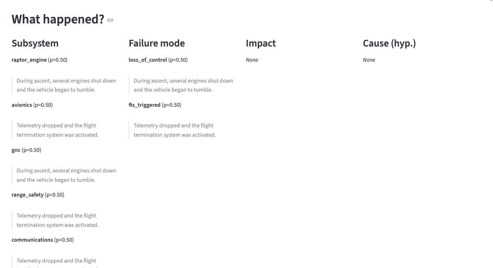
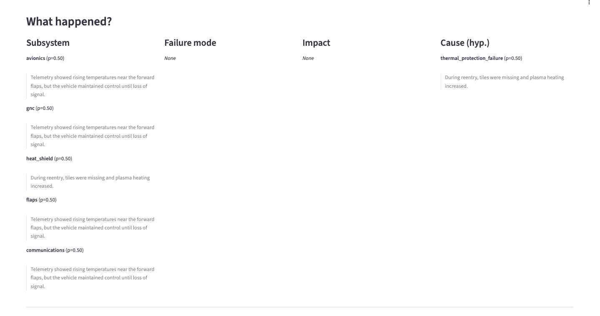
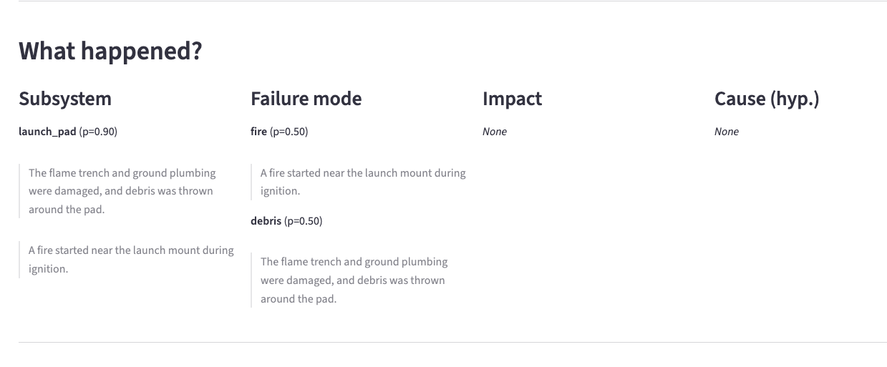

# Starship Anomaly Explainer 

An end-to-end NLP system that converts unstructured public incident narratives about **SpaceX Starship**
(news articles, official statements, community reports) into **structured, evidence-grounded
“What happened?” cards**.

The goal is to study how reliably NLP can extract **engineering-relevant failure information**
from noisy, evolving, real-world text.

---

## What the system produces

For each incident narrative, the pipeline outputs a structured card containing:

- **Subsystem(s)** — multi-label (e.g. raptor_engine, avionics, heat_shield)
- **Failure mode(s)** — multi-label (e.g. loss_of_control, fire, debris, fts_triggered)
- **Impact** — vehicle loss, pad damage, delay, minor anomaly, etc.
- **Cause hypothesis** — optional, explicitly labeled as *hypothesis*
- **Evidence snippets** — supporting sentences extracted from the text (no hallucination)
- **Confidence score** per field

All predictions are tied to **verbatim text spans** from the input.

---

## Demo screenshots

### Ascent anomaly (engine shutdown + FTS)

### Ground systems anomaly (pad fire and debris)

### Reentry anomaly (thermal protection failure)

---

## Why this project matters

Spaceflight incidents generate large volumes of unstructured text but little standardized data.
Analysts must manually translate scattered reports into structured failure timelines.

This project demonstrates how NLP can:
- Perform **multi-label incident classification**
- Extract **evidence-grounded explanations**
- Handle **speculative and evolving narratives**
- Support **engineering analysis**, not text generation

---

## System overview

Pipeline stages:

1. **Input**: raw incident narrative
2. **Sentence segmentation**
3. **Baseline inference**
   - Keyword-based matching (fast, interpretable)
   - TF–IDF + One-vs-Rest Logistic Regression
4. **(Optional)** Transformer fine-tuning (DeBERTa, multi-label)
5. **Evidence selection** (sentence-level grounding)
6. **Structured output card**

---

## Results

- Labeled sample size: 3 incidents (data/processed/incidents.jsonl)
- Baseline: Keyword matching (rule-based) baseline
- Metrics: precision, recall, F1 (micro-avg per field) — subsystem 0.714/0.769/0.741; failure_mode 1.000/0.667/0.800; impact 1.000/0.143/0.250; cause 1.000/0.500/0.667
- Notes: Evaluated keyword baseline predictions (outputs/keyword_preds.jsonl) against gold labels (data/processed/incidents.jsonl) with `python -m src.eval.evaluate --gold data/processed/incidents.jsonl --pred outputs/keyword_preds.jsonl --out outputs/metrics.json`; reproduce by running `python -m src.baselines.keyword_baseline --data data/processed/incidents.jsonl --out outputs/keyword_preds.jsonl` then the evaluation command.

### Qualitative notes

The keyword baseline correctly identifies major subsystems and failure modes
in clear incident narratives (e.g. engine shutdown, FTS activation, pad fire).
Errors primarily occur in speculative or ambiguous reporting, where multiple
failure mechanisms are discussed without confirmation.

Transformer models are included for future scaling once a larger labeled
dataset is available.

